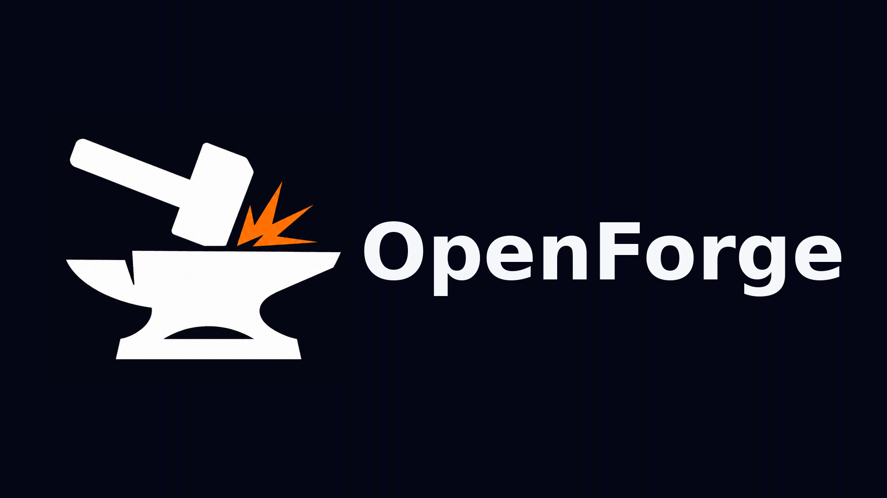

<p align="center">
  
</p>

# OpenForge

[English](../README.md) | [繁體中文](README.zh-TW.md)

OpenForge 是一个本地优先的 AI 编程 CLI 控制平面。它为开发者提供统一的 Web
控制台，用来管理 Claude Code、OpenCode 和 Codex 的项目、持久终端会话、AI
工具配置、模型、API Key、Agent、Skill、模板、插件、用量可视化和会话历史。

OpenForge 面向自托管开发机器和私有工作区。Gateway 负责文件系统访问、SQLite
持久化、tmux 会话、WebSocket 终端流量、加密和 CLI 进程生命周期；Web 控制台是
纯 Next.js SPA，通过 HTTP 和 WebSocket 与 Gateway 通信。

## 项目状态

OpenForge 处于 MVP / 本地优先发布候选开发阶段。核心 Gateway、Web 控制台、tmux
终端链路、认证、加密 API Key 存储、项目设置、适配器发现和管理界面已经具备本地
用户测试条件，并已支持模型服务商 Profile 和在线模型同步。

Codex app-server 生命周期能力仍属于实验功能，并有意隐藏在 Web 控制台的实验功能
区域。托管协作、计费、云部署和自主远程执行不属于当前本地优先 MVP 范围。

## 首次用户试用

- [试用运行手册](TRIAL-RUNBOOK.md)
- [首次运行检查表](TRIAL-CHECKLIST.md)
- [故障排查](TROUBLESHOOTING.md)
- [反馈模板](TRIAL-FEEDBACK.md)

## 为什么使用 OpenForge

- 在浏览器里查看和恢复长时间运行的 AI CLI 工作。
- 统一管理 Claude Code、OpenCode 和 Codex 会话，减少手工混改本地配置文件。
- 使用 tmux 保存终端会话，而不是依赖浏览器标签页或数据库日志。
- 在一个开发者控制台里集中管理项目模板、Agent、Skill、API Key、模型和本地诊断。
- 保持本地优先：密钥、项目路径、终端进程和 SQLite 状态都留在运行 Gateway 的主机上。

## 功能

- 项目创建和导入流程，支持 AI 工具配置生成与合规检查。
- 基于 tmux 的终端会话，浏览器断开或 Gateway 重启后仍可恢复。
- 支持 Claude Code、OpenCode、Codex 的适配器发现和受控会话启动。
- 模型服务商 Profile、加密 API Key 存储，以及 OpenAI-compatible 服务商端点的
  在线模型同步。
- Web 控制台提供 Agent、Skill、模板、插件、用量、历史、通知和设置界面。
- 会话快照、终端专注模式、命令面板原型和本地诊断导出。
- 通过 WebSocket 事件流提供会话状态、通知和缓存刷新。

## 架构

```text
浏览器 xterm.js
  -> WebSocket
  -> Gateway
  -> node-pty
  -> tmux attach
  -> AI CLI 进程
```

仓库结构：

```text
packages/
  cli/       npm 分发的 OpenForge CLI 包装器
  gateway/   Express、WebSocket、tmux/node-pty、SQLite、适配器、服务层
  web/       Next.js App Router、React、Tailwind CSS、xterm.js
docs/        架构、发布、冒烟测试、试用和多语言文档
templates/   内置 AI CLI 配置模板
```

关键规则：

- Gateway 和 Web 是两个独立服务。Gateway API 行为不放进 Next.js API routes。
- REST API 位于 `/api/v1`；终端流量使用 `/ws/terminal/:sessionId`。
- tmux 是终端会话的持久化层。
- 终端历史通过 tmux capture-pane 恢复，不写入 SQLite。
- API Key 只在 Gateway 内存中解密，并通过 tmux 环境变量注入 CLI 会话。

## 环境要求

- Node.js 20 或更高版本
- 源码开发需要 pnpm 9 或更高版本
- tmux 3.2 或更高版本
- 支持 SQLite 的本地文件系统
- 如需真实 AI CLI 会话，需要在 `PATH` 中安装 Claude Code、OpenCode 和/或 Codex

Windows 用户如需使用内置浏览器终端，请在 WSL 中运行 OpenForge。原生 Windows
安装仍可使用管理界面，但可恢复的终端会话依赖 tmux。

## 从 npm 安装

```bash
npm install -g openforge
openforge doctor
openforge start
```

在 `openforge start` 打印的 URL 打开 Web 控制台。

npm 包只安装 OpenForge CLI 包装器，不会安装 tmux、Claude Code、OpenCode 或
Codex。请单独安装计划使用的 AI CLI 工具，并确保它们在 `PATH` 中可用。

## 从源码开发

安装依赖：

```bash
pnpm install
```

创建本地 `.env` 文件。不要提交该文件。

```bash
OPENFORGE_PORT=48731
OPENFORGE_WEB_PORT=48732
NEXT_PUBLIC_GATEWAY_URL=http://127.0.0.1:48731
OPENFORGE_MASTER_KEY=<使用-openssl-rand-hex-32-生成的64位hex字符串>
OPENFORGE_JWT_SECRET=<32位以上随机密钥>
```

分别在两个 shell 中启动 Gateway 和 Web 控制台：

```bash
pnpm --filter @openforge/gateway dev
pnpm --filter @openforge/web dev -- --hostname 127.0.0.1 --port 48732
```

打开 Web 控制台：

```text
http://127.0.0.1:48732
```

运行聚焦检查：

```bash
pnpm --filter @openforge/web typecheck
pnpm --filter @openforge/web test
pnpm --filter @openforge/gateway typecheck
pnpm --filter @openforge/gateway test
git diff --check
```

准备发布级改动时运行全部包检查：

```bash
pnpm -r typecheck
pnpm -r test
pnpm -r build
```

## 文档

- [架构文档](TECH-ARCHITECTURE.md)
- [产品需求](PRD-v1.1-MVP.md)
- [开发计划](DEVELOPMENT-PLAN.md)
- [API 参考](API.md)
- [安全说明](SECURITY.md)
- [冒烟测试指南](SMOKE-TEST.md)
- [发布计划](RELEASE-PLAN.md)
- [故障排查](TROUBLESHOOTING.md)

## 安全

- 不要提交 `.env`、SQLite 数据库、API Key、JWT secret、加密密钥、生成凭据或个人 AI CLI 配置。
- 用户级 Claude Code、Codex、OpenCode 配置应保留在仓库外。
- Gateway 会校验项目路径，并拒绝目录穿越、符号链接逃逸和敏感系统路径。
- WebSocket 终端访问同时需要 JWT 认证和会话级 attach 凭据。
- OpenForge 是本地优先产品，但本地优先并不意味着可以降低终端访问和 API Key 的敏感级别。

## 许可证

OpenForge 使用 [MIT License](../LICENSE) 开源。
