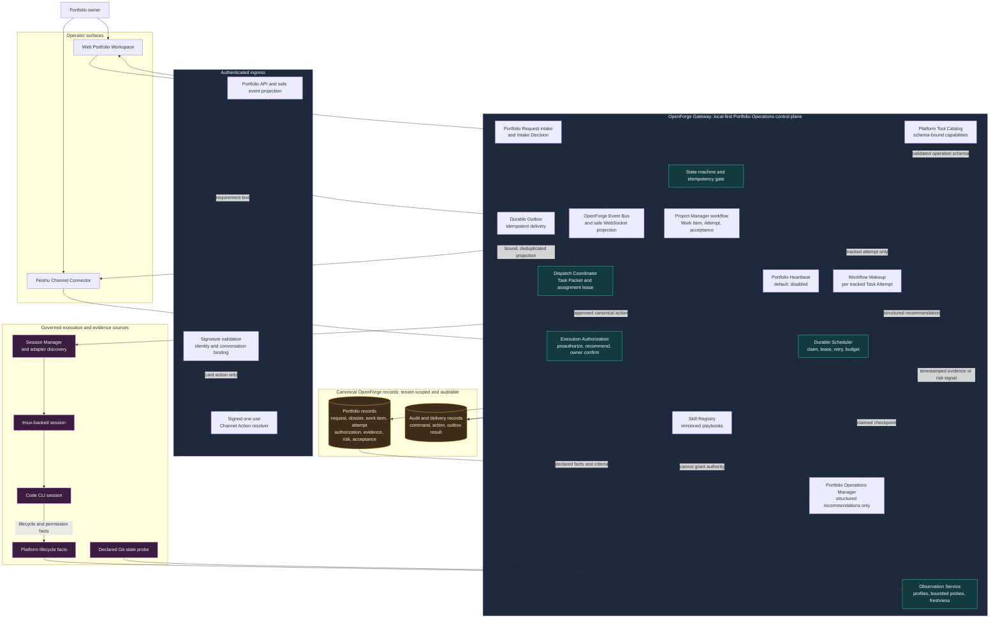

# Portfolio Operations Manager Architecture

**Status:** Gate 1 design baseline; source-level cutover implemented on
`copilot-dev`, with integrated acceptance still pending  
**Scope:** Clean replacement for the Legacy Copilot on `copilot-dev`

## Intent

Portfolio Operations is a local-first **project-group manager**, not a generic chat agent. It receives user requirements, turns them into evidence-backed Project Manager workflow records, governs Code CLI execution, and projects trusted progress to Web and Feishu.

The Gateway is the only authority for state changes, CLI control, permissions, and external delivery. Model reasoning is advisory: it can create a structured recommendation, but it cannot make a lifecycle transition, execute a command, or approve itself.

## System Architecture



### Diagram reading guide

1. Web and Feishu both create an immutable **Portfolio Request**. Feishu free text can request work, but cannot become terminal input or an approval payload.
2. The control loop consults only declared, timestamped evidence. It proposes an Intake Decision, forecast, risk response, or governed action to the Gateway state-machine gate.
3. The state-machine gate is the sole path to a durable transition. It performs tenant, idempotency, lifecycle, and authority checks before recording a fact and publishing an event.
4. A Work Item enters `in_progress` only after a governed Task Attempt has been dispatched to a tmux-backed Code CLI session. CLI and Git facts return through Observation Service as Evidence; elapsed time creates a Risk Signal, never an automatic `blocked` or `done` state.
5. The global Heartbeat is an optional, budgeted reconciliation source. A tracked Task Attempt has its own durable Workflow Wakeup, so follow-up still works when the global Heartbeat is off.

## Architectural Boundaries

| Boundary | Enforced rule |
| --- | --- |
| Canonical state | Tenant-scoped Portfolio records and audit records are the truth. Web and Feishu are projections, never competing databases. |
| Model | The manager receives evidence-backed context and emits structured recommendations only. It cannot call tmux, run shell text, mutate state, or override authorization. |
| State transition | The Gateway state-machine and idempotency gate owns every Work Item, Task Attempt, Authorization, and Acceptance transition. |
| Permission | Preauthorization may approve a known action; normal unmatched actions need an owner decision; Protected Actions always need owner confirmation. All decisions are durable and auditable. |
| Skill | A Skill chooses a versioned sequence from the Platform Tool Catalog. It can never add a tool or escalate its own authority. |
| Observation | Only an enrolled project with an Observation Profile is observable. V1 includes platform facts and declared Git-state probes; arbitrary model-generated shell commands are excluded. |
| Scheduling | Jobs are durable, leased, idempotent, and budgeted. Heartbeat is off by default; Workflow Wakeups are tied to explicit tracking choices. |
| Channel | Feishu requires identity binding and allowed conversation scope. Approval cards carry an opaque signed, single-use reference to an existing record. Delivery uses a durable Outbox. |
| Extension | V1 contains OpenForge Platform Tools and the native Feishu connector only. MCP Extensions are intentionally outside this architecture. |
| Replacement | No arrow connects Legacy Copilot data or runtime to this diagram. Clean Cutover removes Gateway routes, runtime, and state access instead of creating compatibility or dual-write paths; `/portfolio` remains the complete workspace, `/copilot` is its Portfolio-only alias, and the pet opens a floating Portfolio Dialog that creates Requests and reports only persisted safe Request status. |

## Reference Patterns: Adopt, Improve, Exclude

| Reference | Adopt for OpenForge | Improvement or deliberate exclusion |
| --- | --- | --- |
| OpenClaw | Local Gateway as control plane; account-aware channel ingress; explicit identity pairing and allowlists; persistent scheduler and task-flow concepts. | Keep a single native Feishu connector in V1. Do not inherit a broad dynamic channel, plugin, or model-tool surface. Channel ingress can create requests, not arbitrary executable instructions. |
| Hermes Agent | Explicit delivery routing, channel/platform directory separation, turn ownership, and scheduler lifecycle handling. | Use strict durable assignment and wakeup leases. Do not permit a degraded lease timeout to start a concurrent Code CLI operation; ownership conflicts must remain visible and retryable. |
| DeepSeek Harness | Durable typed event vocabulary; model-visible provenance; approval and scheduling decisions that survive a restart; capability seams. | Preserve domain facts rather than a generic conversation log as the source of truth. A Platform Tool is a narrow, server-owned capability seam, not a model-discovered executable tool. |

## Primary Flows

### Requirement to governed execution

```text
Web or bound Feishu message
  -> Portfolio Request
  -> evidence-backed Intake Decision
  -> Project Manager Work Item
  -> Task Attempt plus deterministic Task Packet
  -> authorization evaluation
  -> assignment lease and Code CLI session
  -> evidence, completion candidate, acceptance decision
  -> canonical update and Web/Feishu projection
```

### Progress tracking

```text
CLI lifecycle event, declared Git probe, Workflow Wakeup, or optional Heartbeat
  -> durable scheduler claim when applicable
  -> bounded observation
  -> timestamped Evidence and freshness evaluation
  -> Risk Signal or manager recommendation
  -> verified lifecycle transition only when the state-machine preconditions hold
```

## Implementation Consequences

- Build the new module under a new `/api/v1/portfolio/**` contract and isolated Gateway/Web namespaces. Do not reuse `services/copilot/**` as a base class or read its records as input.
- Reuse only proven platform foundations: authentication, tenant-scoped repositories, audit/redaction, Event Bus, Outbox mechanics, Session Manager, tmux, adapter discovery, CLI lifecycle hooks, and Project Manager domain records whose invariants match.
- Every external ingress, scheduled claim, authorization decision, dispatch request, evidence record, and outbox delivery needs an idempotency and audit record before the Clean Cutover.
- The next design artifact should turn this architecture into explicit state machines, command schemas, persistence tables, event names, and authorization matrices before implementation begins.
